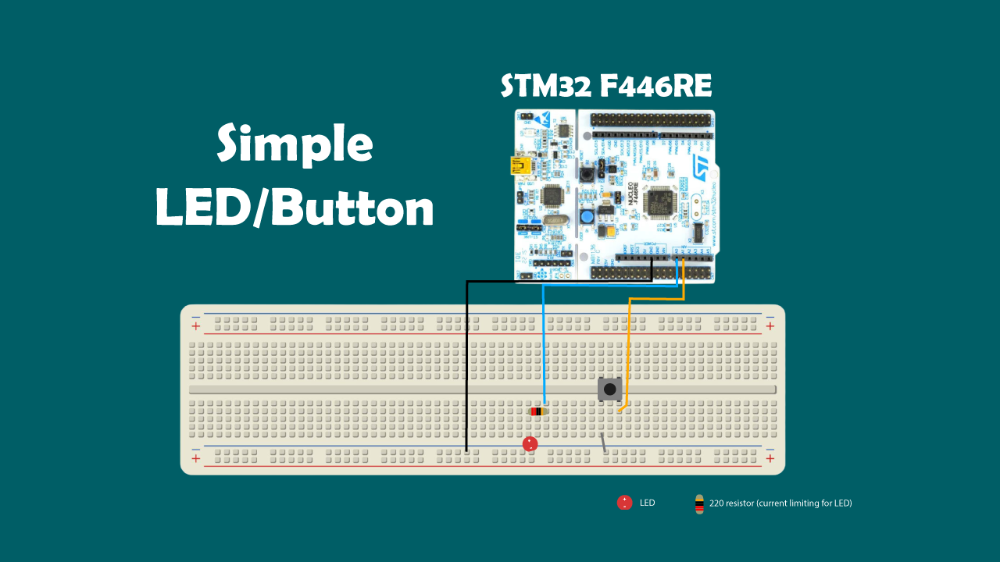

# STM32 GPIO Driver (Bare-Metal)

This project demonstrates a minimal, register-level GPIO driver written in C for STM32 microcontrollers.  
The goal is to showcase an understanding of memory-mapped I/O, bit manipulation, and clean driver-layer abstraction without relying on vendor libraries such as HAL or LL.

---

## Features

- Direct register-level control with no HAL or LL
- Struct-based peripheral mapping using `GPIORegisters`
- GPIO pin mode configuration
- Pull-up and pull-down configuration
- Atomic pin set and clear using `BSRR`
- Non-atomic pin writes using `ODR`
- GPIO input reading as both numeric and boolean values
- Clear separation between hardware definitions, driver code, and application logic

---

## Concepts Demonstrated

- Memory-mapped peripheral access
- `volatile` register access
- Bit masking and bit shifting
- Atomic vs non-atomic writes
- Low-level driver design
- Active-low button input handling

---

## Project Structure

```text
├── hardware.h   # Base addresses, RCC register, GPIO register layout, peripheral instances
├── driver.h     # Driver API declarations, enums, helper macros
├── driver.c     # Driver implementation
└── main.c       # Application logic example
```

## Example Usage

```c
int main()
{
    init();

    while (1)
    {
        bool isButtonPressed = !read_pin_as_boolean(GPIOA_REGS, BTN_PIN);

        if (isButtonPressed)
            set_pin_by_bsrr(GPIOA_REGS, LED_PIN);
        else
            clear_pin_by_bsrr(GPIOA_REGS, LED_PIN);
    }
}
```

---

## Behavior

- Press and hold the button to turn the LED on
- Release the button to turn the LED off

**Note:** The button is configured as active-low using an internal pull-up resistor.

---

## Hardware Setup


- STM32 microcontroller
- LED connected to PA0
- Button connected to PA1
- Internal pull-up enabled on the button input

---

## Notes

- BSRR is used for atomic set and clear operations
- ODR is used for non-atomic read-modify-write operations
- The example in main.c does not implement debounce
- This project currently demonstrates GPIOA only

---

## Future Improvements

- Add software debounce
- Add timer-based delay or system tick support
- Add interrupt-driven GPIO input handling
- Add support for additional GPIO ports such as GPIOB and GPIOC
- Add a higher-level hardware abstraction layer with functions like `led_on()` and `button_is_pressed()`

---

## Purpose

This project is intended as a portfolio piece to demonstrate low-level embedded systems knowledge, including:

- register-level programming
- memory-mapped I/O
- GPIO driver design
- hardware-aware application structure

---

## Contact

Edwin Martinez <br/>
**Software Engineer | Embedded Systems** <br/>
GitHub: https://github.com/jodadev  
LinkedIn: https://linkedin.com/in/jodadev
